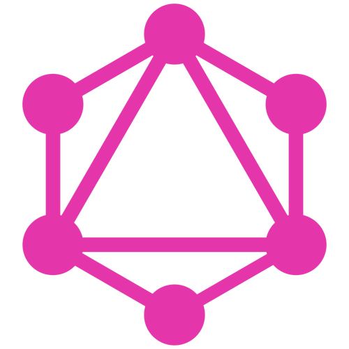

Hello :rooster:

<head>
    <link rel="stylesheet" href="style.css">
    <link rel="stylesheet" href="https://cdnjs.cloudflare.com/ajax/libs/normalize/5.0.0/normalize.min.css">
   <link rel='stylesheet' href='https://maxcdn.bootstrapcdn.com/bootstrap/3.3.5/css/bootstrap.min.css'>
   <link rel='stylesheet' href='https://maxcdn.bootstrapcdn.com/font-awesome/4.4.0/css/font-awesome.min.css'>
</head>

      
      <h2>SkillSet</h2>
  

     

        

            
        
 
     

     

         

                 
         

     

     

         

             
         

     

     

        

                
        

     

     

        

                
        

     

     

        

                
        

     

  

   
   
  

    

       

           
       

    

    

       

           
       

    

    

       

               
       

    

    

       

           
       

    

    

       

               
       

    

    

       

               
       

    

  

  

